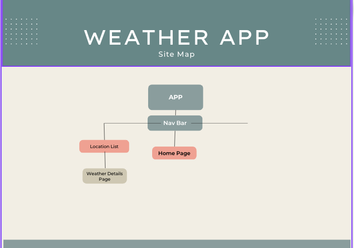
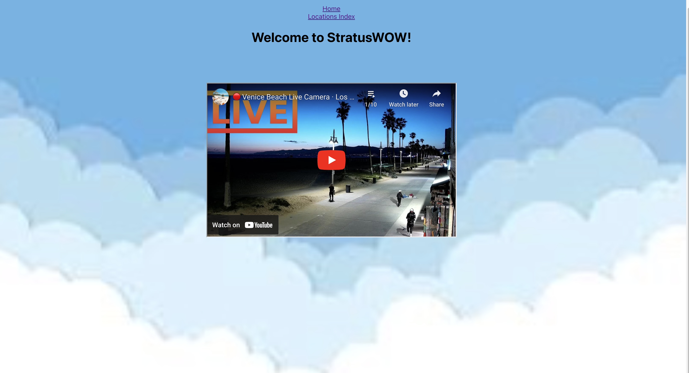
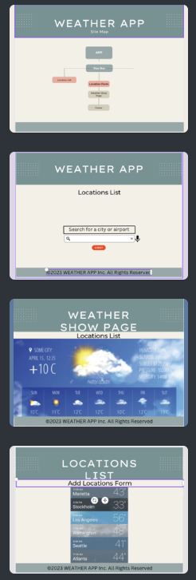

# Stratus Wow🌤️

This is a fully functional React application where users can view the current weather condiditions of the avaliable listed cities.

## Application Previews
Site Map

# Home Page

# WireFrame

# Technologies Used:

Trello, React, Open Weather API, Javascript, CSS, JSX, and Netlify

# Getting Started:

https://stratus-wow.netlify.app

When the site loads, the user will land on the homepage and see the greeting message as well as a live camera playlist of most of all of the major cities that are listed on the Locations Index page. The user should be able to navigate between the Homepage, Locations Index page and the Locations Details page by utilizing the Navigation bar.

# Next Steps:
Improve styling,  
Add in a location search feature,
An 'Add Location' Form

